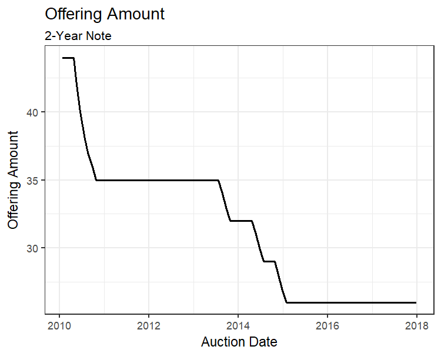
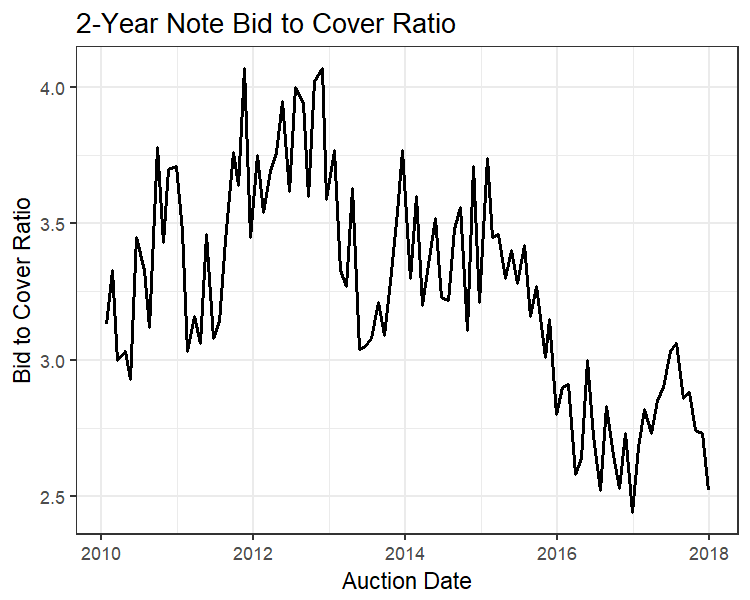
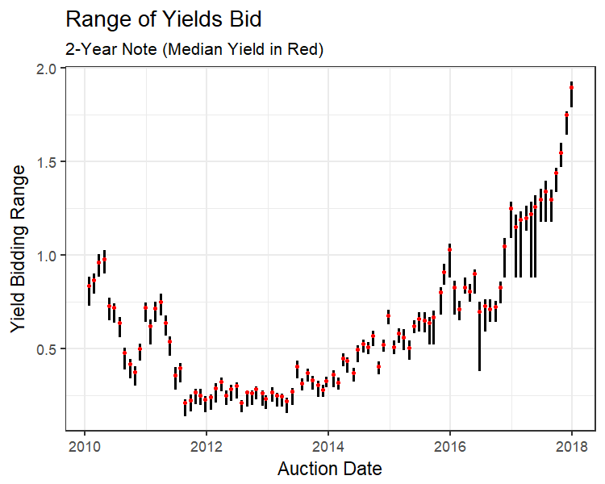
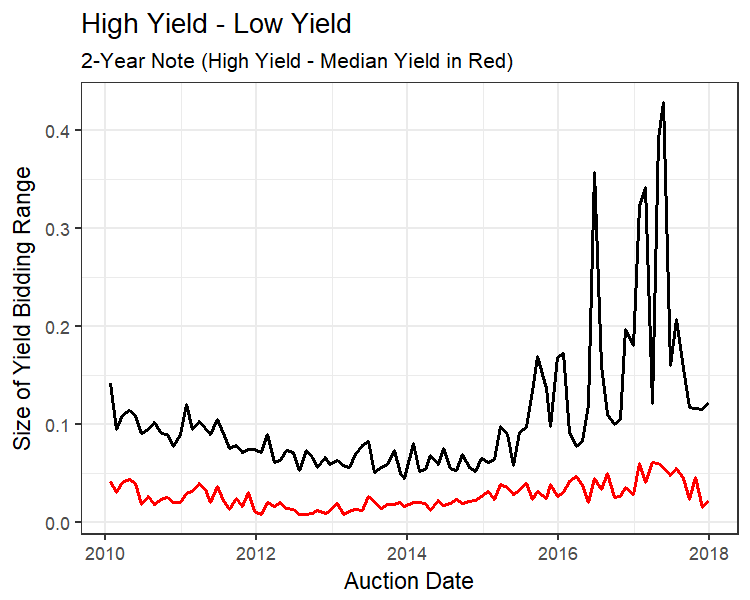
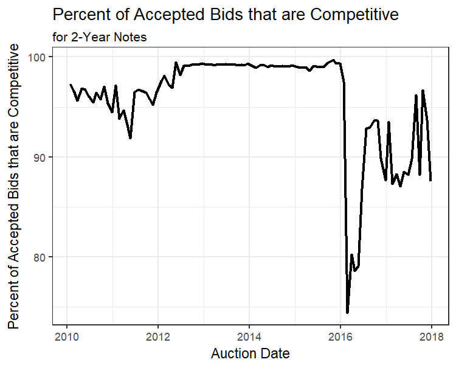
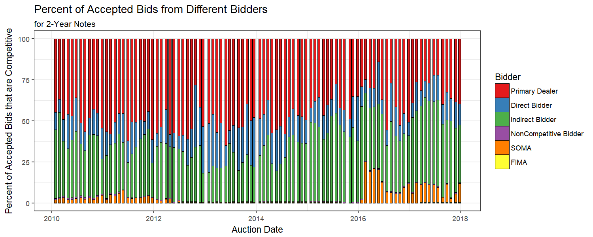
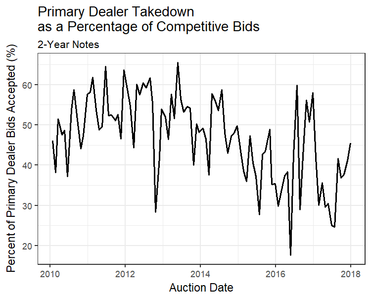

When I was a senior in undergrad, I wanted to do a project on dealer takedown for U.S. Treasury auctions. I discovered that every aspect of every auction since April, 2008 is wonderfully archived on Treasury Direct's [website](https://www.treasurydirect.gov/instit/annceresult/press/press_auctionresults.htm). Unfortunately, I also discovered that I had no clue how to download and parse hundreds of XML files (other than by hand).

I discovered [another resource](https://www.treasury.gov/resource-center/data-chart-center/Pages/investor_class_auction.aspx) within treasury.gov going back to 2000 that allowed me to do my project, but I still wished I could've used all of the details from [each](https://www.treasurydirect.gov/instit/annceresult/press/preanre/2016/R_20161025_2.pdf) Treasury auction.

Several additional Computer Science and Statistics courses later, downloading and parsing XML files is doable for me. In this write up, I will go into the details of how to use [my code on Github](https://github.com/gjkoplik/get_treasury_data) to gather these data (even if you aren't a "coder"), and I'll show some of the richness embedded in these data.

## Some Qualifiers to Using This Code

First, a note on the constraints with my code. My code is based on downloading and parsing XML files on Treasury Direct's website (if you're curious, these files look like [this](https://www.treasurydirect.gov/xml/R_20161025_2.xml)). However, these files are only accessible <b>after April, 2008</b>, so if your project depends on having auctions data prior to that period, I recommend using the treasury.gov [resource](https://www.treasury.gov/resource-center/data-chart-center/Pages/investor_class_auction.aspx) (and if you want auction information preceeding 2000, then I'm afraid you're on your own).

## Using the Code to Download a Dataset

### Download Folder from Github

First, download the folder `automate_script` from [my Github repo](https://github.com/gjkoplik/get_treasury_data)

### Running the Automated Version

I've written a batch file `run_scripts.bat` that first asks for user input (security name, whether you want TIPS / FRN, and a date range). The file then opens up a Google Chrome window using Selenium in Python to download a dataset of the dates of the Treasury auction of interest. Next, the file uses R to take each date, download the relevant Treasury auction (in XML format), parse it, and store it as a row in a dataset.

The final result will be two files in the same folder as the scripts: one file with the rows of successfully downloaded and parsed Treasury auctions, and the other file with the dates of the auctions that failed to download and parse (more on why this happens later, but for now note this does not neccesarily mean that your dataset is incomplete).

As interesting as it was to automate this much of the process, the batch file has an enormous number of dependencies with my computer (Windows Operating System, Google Chrome that is compatible with Chrome Drive 2.35, Python 2.7 and R 3.3.3 with appropriate command line paths on your computer, and all relevent packages inside each python and R script). Given that, there is little chance you will be able to run `run_scripts.bat` without a substantial amount of debugging.

That being said, plenty of people think automation in data science will [continue to increase](https://www.kdnuggets.com/2015/05/data-scientists-automated-2025.html), so modifying these scripts to work on your computer is a fruitful exercise for some of you.

For those of you who are here solely to build a dataset (not play around with Selenium and batch files), follow the directions in the next section.

### Modifying One File Instead

After downloading the folder `automate_script` from [Github](https://github.com/gjkoplik/get_treasury_data), you will want to open and follow the commented instructions in `use_xml_parser.R`. Note this script has dependencies on `get_xml.R`.

Other than making sure you have the necessary packages in those two R scripts, you need to do two things.

First, you will need to modify several equalities and comment out several lines of code, all specified towards the beginning of `use_xml_parser.R` and marked with comments in the code.

Second, you will need a csv file containing the dates of the auctions of the security for which you are interested. The easiest way to do this is to go to Treasury Direct's [Auction Queries](https://www.treasurydirect.gov/instit/annceresult/annceresult_query.htm) section that lets you search for auctions based on, among other things, security type (the automated code was doing exactly this to get the relevant dates):

 

 

All you need to do is:

- Specify the correct Security Term.

- Make sure you can see at least the entire date range you want for your final dataset (don't worry if you have more than that range, the other code modifications you made will truncate it accordingly). If you cannot see all of the dates you wanted, you can change the show rows drop down box at the bottom of the page.

- Download the dataset, and be sure to download as a csv.

- Move the dataset into the same folder as `use_xml_parser.R` and `get_xml.r`

Note, although the dates on this website go back further than April, 2008, you will not be able to get those auctions in your final dataset when you run the code.

You can easily download these data in csv format by clicking the "csv" button above the dataset. Be sure to leave the name unchanged as the code assumes the file name is `Securities.csv`

### Load Packages Needed to Run the Code

Again, you will need to have all the packages loaded in using the `library()` command at the top of both `use_xml_parser.R` and `get_xml.r`

If those packages do not load (most are not installed by default in R Studio), you will need to install the packages.

All you need to do is go to the console (bottom left in R Studio), and run the `install.packages()` function for each function. As an example, this is how you would install the `zoo` package:

	
`> install.packages("zoo")`
	

	
Note that the package name must be in quotations when installing the package.

### Run the Code

You are now ready to run the code!

In `use_xml_parser.R`, go to Code (next to Edit top left), then highlight "Run Region," and select "Run All"

This will generate two csv files in the same directory in which you saved the R code.

One file will contain rows of successfully downloaded and parsed Treasury auctions, and the other file will contain the dates of auctions that failed to download and parse.

### Why Some Dates Fail to Parse Correctly

Having some failed dates does not neccesarily mean your dataset is incomplete. There are many possible reasons why you are getting a non-empty file of failed dates, including:

- a misspecified date range (not in the right "MM-DD-YYYY" format, dates preceeding April 2008, switching the maximum date and the minimum date, etc).

- an improper specification (incorrectly specifying security name, an impossible combination of security, TIPS, and FRN (e.g. there are no 4-week bill TIPS auctions), accidentally specifying `TIPS = "Y"` or `FRN = "Y"` when you meant to say `"N"`, etc). This is especially likely if you have no dates that work correctly.

- something weird happening on Treasury Direct's end (I'll go through an example of this later with 2-year Notes).

- a change to Treasury Direct's website that stops this code from working in the future.

- an error in the code I wrote (I have checked multiple possible inputs to these scripts, but not all of them. It's possible I've missed a case that breaks this code).

### Confirm Things Are Working

It's always good to double-check that a script is doing what you think it should (especially if you didn't write the code). This code is dependent on the URL structure of Treasury Direct's website being the same as when this code was written, so it's worth double checking a few of these. I recommend going to Treasury Direct's
[website](https://www.treasurydirect.gov/instit/annceresult/press/preanre/preanre.htm)
and checking a few to see if things are lining up.

### One Last Note on Running This Code

These auction files change occasionally over time such that they do not all have the same column values. In other words, columns that exist for one auction file do not necessarily exist for every auction file that you are reading into your dataset. In your final dataset, all columns observed over all securities will be included. The column values that don't exist for a given auction will be filled in as `NA` for that row in the dataset.

## An Example: 2-Year Note Auctions

It's worth noting that although the [alternative source](https://www.treasury.gov/resource-center/data-chart-center/Pages/investor_class_auction.aspx) of Treasury auction information offers a bit more nuance with respect to the allocation of the security being auctioned, the dataset we are discussing here offers substantially more overall information about each auction, which I will show via an example.

I've used this code to download a dataset of 2-year note auctions from the beginning of 2010 through the end of 2017.

Let's make some figures using our richer dataset.

A simple enough starting point is the size of the auctions over time:

{width=50%}

 

As we can see, the size of two-year note auctions has decreased over time. Using this code, we could explore changes in other securities' offering amounts over time.

We could also look at the <i>bid-to-cover ratio</i>, or the ratio of the sum of the amount bid over the size of the auction:

{width=50%}

 

With datasets for securities of varying maturities, we could explore changes in bidder interest in various securities over time.

Perhaps we're interested in the range of bids being placed over time:

{width=50%}{width=50%}

 

The figure on the left shows us that after mid-2016, there are periods where we observe a substantial increase in the range of yields bid. The figure on the right shows that despite these periodic increases in yield bidding range, the difference between the high yield and the median yield is fairly stable over time, implying some party or parties began placing unusually low-yield competitive bids in mid-2016. Note that the <i>high yield</i> of an auction is the highest yield (lowest price) that was accepted at the auction (see the [Appendix] for more details about how Treasury Auctions work in the U.S.).

For my final example, let's start with the percentage of competitive bids accepted over time:

{width=50%}

 

We see there is a drastic decrease in competitive bids accepted; however, note that this change is almost entirely a result of an increase in non-competitive bids from the Fed's System Open Market Account (SOMA):

{width=100%}

 

Although this seems like a simple explanation for the changes in competitive bidder takedown, there may still be heterogeneity among different competitive bidders over time. For example, we could explore changes in primary dealer takedown specifically. Primary dealers are a set of about twenty banks that,
[according to](https://www.newyorkfed.org/markets/primarydealers.html)
the New York Fed, partner with the Federal Reserve Bank of New York to "serve as trading counterparties of the New York Fed in its implementation of monetary policy." Primary dealers are required to bid in all Treasury auctions, which begs the question, to what extent do their bids change over time as a result of changing macroeconomic conditions?

{width=50%}

 

There's a lot of variation here, but there are also signs of secular change within that variation. After controlling for things like coupon rate, size of auction, strength of the U.S. dollar, and primary dealer holdings, we might be able to start answering this question, but that's a project for another write-up.

### Why Some Dates Fail for This Example

If you try to gather the same dataset that I am using here, you will notice that there are fifteen failed dates, and you might be wondering if there's an error with either the code or your use of it. For this example, the answer is neither:

 

You can see in the figure above that there are both 2-year note auctions and 2-year <i>floating rate note</i> auctions. It turns out that the auction date every 2-year FRN auction that is exactly two years to maturity shows up in our [source of dates](https://www.treasurydirect.gov/instit/annceresult/annceresult_query.htm)
for 2-year (non-floating rate) note auction dates. Therefore, these dates failing actually means the code is working correctly for this example.

## Appendix

The U.S. Treasury generally announces an upcoming auction on the Thursday the week before the auction. This initiates "when-issued" trading among future bidders, essentially meaning that individuals are trading these Treasury securities before the Treasury has actually auctioned them.

These auctions are uniform price auctions, meaning that individuals bid for the quantity of securities they want and minimum yield for which they want to own those securities. Bidders can submit these competitive bids, which will not necessarily be filled, or they can submit noncompetitive bids, which are guaranteed to be filled at the "stop" price, or the final price that all winners of the auction will pay per treasury security.

Once competitive bidding has closed, all bids are fed into the Treasury's TAAPS (Treasury Automated Auction Processing System) software to determine the stop price. This works by starting with the amount of securities being auctioned, subtracting the amount of noncompetitive bids, and filling the lowest competitive bid yields until all securities being auctioned have been allocated. The stop price is the price of the highest-yield bid that was filled. If the amount of competitive bids at the stop price would bring the total amount of securities sold above the original auction amount, then these competitive bids are partially filled. These bidders are allocated a fraction of the remaining securities as a proportion of their quantity bid out of the total quantity of stop price-competitive bids. All securities in one auction are transferred to the winners at the stop price.

$_\blacksquare$

